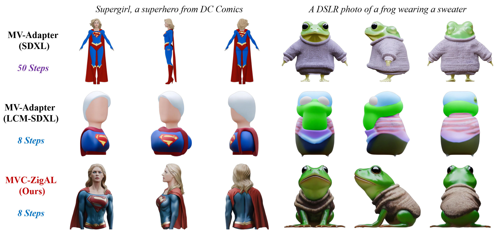

# Refining Few-Step Text-to-Multiview Diffusion via Reinforcement Learning

<div align="left">
  <a href="https://arxiv.org/abs/2505.20107" target="_blank"></a>
  <a href="https://drive.google.com/file/d/1KTNNFPBrOAvwbz_5w0ufFMoooigmt3vL/view?usp=drive_link"  target="_blank"></a>
  <a href="#" target="_blank"></a>
</div>

This repository contains the official implementation of **MVC-ZigAL**, as presented in [*Refining Few-Step Text-to-Multiview Diffusion via Reinforcement Learning*](https://arxiv.org/abs/2505.20107).

## 🚀 Introduction

Text-to-multiview (T2MV) generation, which produces coherent multiview images from a single text prompt, remains computationally intensive, while accelerated T2MV methods using few-step diffusion models often sacrifice image fidelity and view consistency. To address this, we propose a novel reinforcement learning (RL) finetuning framework tailored for few-step T2MV diffusion models to jointly optimize per-view fidelity and cross-view consistency. Specifically, we first reformulate T2MV denoising across all views as a single unified Markov decision process, enabling multiview-aware policy optimization driven by a joint-view reward objective. Next, we introduce ZMV-Sampling, a test-time T2MV sampling technique that adds an inversion-denoising pass to reinforce both viewpoint and text conditioning, resulting in improved T2MV generation at the cost of inference time. To internalize its performance gains into the base sampling policy, we develop MV-ZigAL, a novel policy optimization strategy that uses reward advantages of ZMV-Sampling over standard sampling as learning signals for policy updates. Finally, noting that the joint-view reward objective under-optimizes per-view fidelity but naively optimizing single-view metrics neglects cross-view alignment, we reframe RL finetuning for T2MV diffusion models as a constrained optimization problem that maximizes per-view fidelity subject to an explicit joint-view constraint, thereby enabling more efficient and balanced policy updates. By integrating this constrained optimization paradigm with MV-ZigAL, we establish our complete RL finetuning framework, referred to as MVC-ZigAL, which effectively refines the few-step T2MV diffusion baseline in both fidelity and consistency while preserving its few-step efficiency.



## 📦 Installation

Clone the repository, create a new conda environment, and install all dependencies within it:

```bash
# Clone this repository
git clone https://github.com/ZiyiZhang27/MVC-ZigAL.git
cd MVC-ZigAL

# Create and activate a new conda environment (Python 3.10+)
conda create -n mvczigal python=3.10 -y
conda activate mvczigal

# Install PyTorch with the appropriate CUDA version (we tested with CUDA 11.8)
pip install torch==2.6.0 torchvision==0.21.0 --index-url https://download.pytorch.org/whl/cu118

# Install the remaining dependencies
pip install -e .
```

💡 **NOTE:** To faithfully reproduce our results, we recommend using `CUDA 11.8` with NVIDIA RTX 4090 GPUs, along with `torch==2.6.0` and `torchvision==0.21.0`. Other setups might also work, but have not been extensively tested.

## 🔥 Training

Since our reward function is based on the HyperScore model from the [MATE-3D](https://github.com/zhangyujie-1998/MATE-3D) codebase, **please first download its checkpoint from [OneDrive](https://1drv.ms/u/c/669676c02328fc1b/EbUs_rWDXtREoXW_brOk_bkBzdFM6hyxFUoevRhRj1Zxmw?e=l4gIgs) and place it in the `mate3d/checkpoint` directory**. Then, you can launch the training script with:

```bash
CUDA_VISIBLE_DEVICES=0,1,2,3 accelerate launch scripts/train.py
```

Checkpoints will be automatically saved to the `logs/` directory, and training logs will be available on your Weights & Biases dashboard (configured during your first run).

💡 **NOTE:** Training hyperparameters are pre‑configured in `mvczigal/config/mvczigal.yaml` for a 4‑GPU setup (NVIDIA GeForce RTX 4090, 24 GB each). If you have additional GPU memory available, increase `sample_batch_size_per_gpu` and `train_batch_size_per_gpu` while proportionally reducing `gradient_accumulation_steps`; you can also disable gradient checkpointing (`gradient_checkpointing: false`) if desired.

## ❄️ Inference

Once training is complete—or if you prefer to **use our trained checkpoint (available for download on [Google Drive](https://drive.google.com/file/d/1KTNNFPBrOAvwbz_5w0ufFMoooigmt3vL/view?usp=drive_link))**—you can generate multiview images from text prompts with:

```
python scripts/inference.py \
    --text "A DSLR photo of a frog wearing a sweater" \
    --seed 42 \
    --num_inference_steps 8 \
    --lora_model "checkpoint/mvczigal_lcm_sdxl_lora.safetensors" \
    --output "output.png"
```

⚙️ **Arguments:**

- `--text`: The input text prompt describing the scene to generate.
- `--seed`: Random seed.
- `--num_inference_steps`: Number of inference steps (default: 8).
- `--lora_model`: Path to the trained LoRA checkpoint. **If using your own trained checkpoint, replace with `logs/xxxxx/epoch_69/mvczigal_lcm_sdxl_lora.safetensors`**, where `xxxxx` corresponds to your specific training run name.
- `--output`: Output file path and name for the generated image (with views combined in a single row).

## 📝 Citation

If you find this work helpful in your research, please consider citing:

```
@article{zhang2025refining,
  title={Refining Few-Step Text-to-Multiview Diffusion via Reinforcement Learning},
  author={Ziyi Zhang and Li Shen and Deheng Ye and Yong Luo and Huangxuan Zhao and Lefei Zhang},
  journal={arXiv preprint arXiv:2505.20107},
  year={2025}
}
```

## 🤝 Acknowledgements

- This repository builds upon [MV-Adapter](https://github.com/huanngzh/MV-Adapter) and [RLCM](https://github.com/Owen-Oertell/rlcm). We thank the respective authors for their valuable contributions.
- We also make use of code and pretrained models from [MATE-3D](https://github.com/zhangyujie-1998/MATE-3D), [PickScore](https://github.com/yuvalkirstain/PickScore), [HPSv2](https://github.com/tgxs002/HPSv2), and [ImageReward](https://github.com/THUDM/ImageReward). We thank the respective developers for making their resources publicly available.